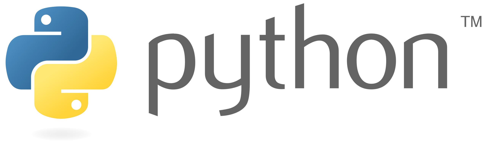

# Aprender Python

<!-- # Aprender-  -->

my process to learn python with courses, sololearn and freecodecamp
## Descripción

En este repositorio documento mi proceso para aprender *python* un lenguaje de programación con una sintaxis facil de leer y entender, este proceso lo hago conjuntamente con cursos como el de universidad de python, el de freecodecamp, soloLearn y leyendo por mi parte la documentación
 
 ## Índice
 - 1 ... Introducción
 - 2 ... Variables en python
 - 3 ... Tipos de datos 
